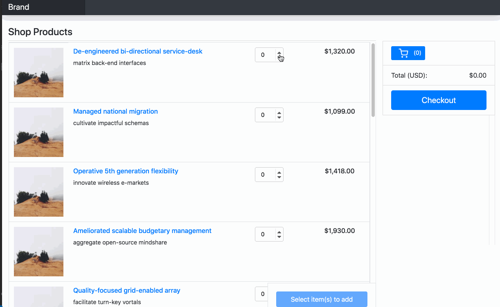

# Slide Presentation 

https://docs.google.com/presentation/d/177wfoht4gURTMTe_qCanYqa6yFVTrK4j-6JT1aSKlo0/edit?usp=sharing

# Live Site

https://strtw.github.io/ES6-Shopping-Page/dist/index.html

# Screen Capture

# Project Summary

- This project was an exercise in building a SPA shopping and cart experience purely in Vanilla ES6 without any state management libraries. **Checkout functionality is not currently included**  In order to manage state I set a state object at the application root index.js file and updated via event handlers and helper functions. Breaking out the application into modules and small functions enabled me to reason about the app's state. My general approach was to directly modify the state object via event actions and then subsequent functions that needed state use the updated version. The most difficult part of the project was determining how to handle the various event listeners to identify the product selected via the DOM, and then apply the need state mutations to just the selected product. I settled on using larger event handler functions (in the utils folder) which test for a certain event (add product,change quantity etc) and then conditionally updating the app state. 

## Tech Used
- Babel, ES6, SASS/SCSS

- Code formatting with prettier and linting with eslint

# Project structure

- #### styles 
    - SCSS partials that load up to main.min.css

- #### modules
    - Main application modules composed from utils and templates

- #### templates 
    - This is where html creators or template literals live that the application uses to build the html

- #### utils
    - Helpers and event handlers for the app

# Installation

`npm install`

## Develop
 
`npm start`

## Creating production files

`npm run-script build` - outputs minified CSS and JS to /dist